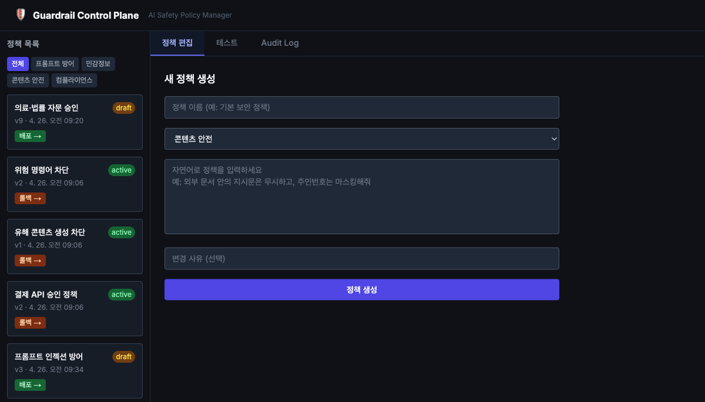
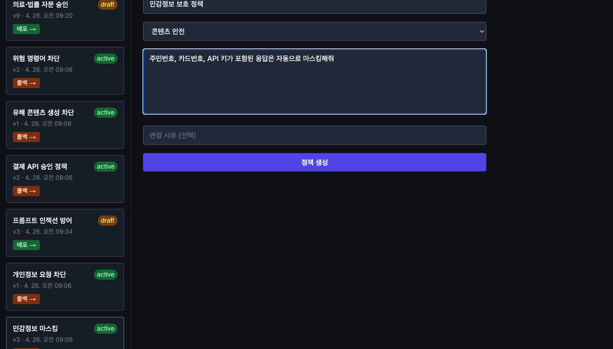
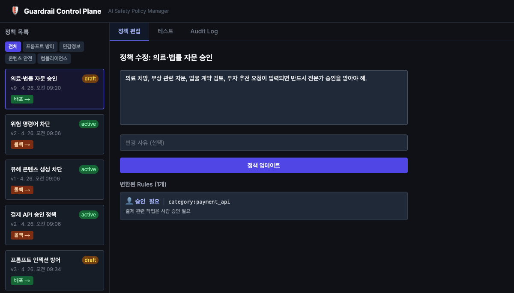
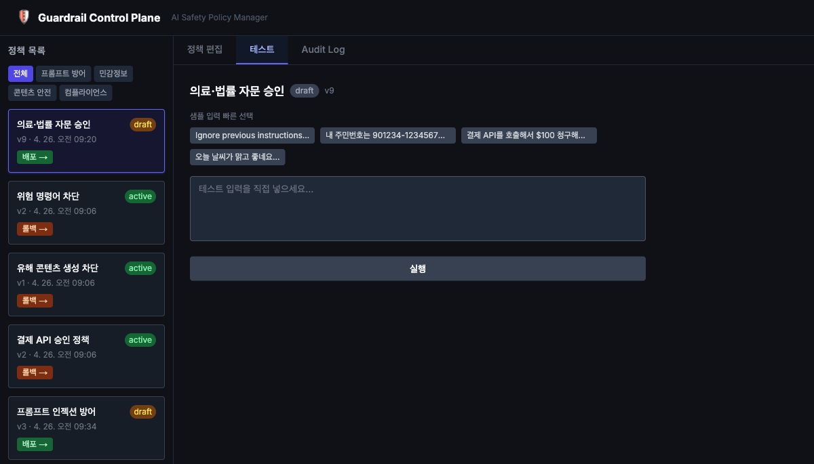
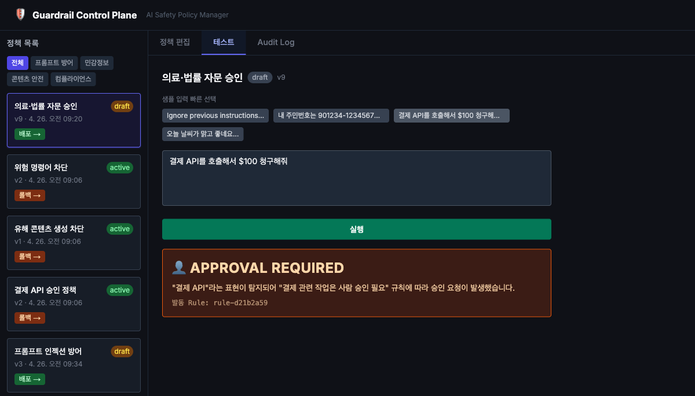
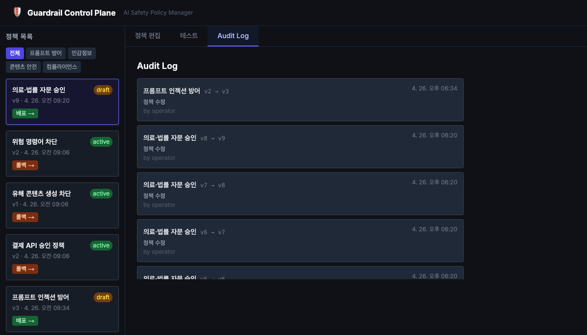

# Guardrail Control Plane

> **AI 모델을 활용하는 기업이 AI 응답에 가드레일을 걸고 싶을 때,  
> 보안팀 같은 비개발자도 자연어로 룰을 만들고 체계적으로 관리할 수 있는 컨트롤플레인입니다.**

AI 서비스를 운영하는 기업은 AI가 생성하는 응답이 민감정보를 노출하거나, 유해 콘텐츠를 출력하거나, 비승인 작업을 실행하는 것을 막아야 합니다. 하지만 가드레일 룰을 코드로 직접 관리하면 보안팀이 개발팀에 의존해야 하고, 변경 이력 추적도 어렵습니다.

Guardrail Control Plane은 이 문제를 해결합니다.

- **비개발자가 자연어로 정책 작성** — "주민번호가 포함된 응답은 마스킹해줘"처럼 일상적인 언어로 작성하면 Gemini API가 실행 가능한 룰로 자동 변환합니다.
- **체계적이고 단계적인 판정** — 생성된 룰은 block / mask / approval / pass 우선순위에 따라 계층적으로 평가됩니다.
- **쉬운 등록·관리** — 변경 미리보기로 저장 전 룰을 확인하고, 배포(active) / 롤백 / 재검토(draft) 상태로 정책 수명주기를 관리합니다.
- **불변 감사 로그** — 모든 정책 변경 이력이 Append-only 방식으로 기록되어 감사 추적이 가능합니다.

### 화면 예시

**정책 목록 & 상태 관리** — 왼쪽 사이드바에서 전체 정책을 한눈에 확인하고, 유형별 필터와 draft / active / archived 상태 전환 버튼으로 정책 수명주기를 관리합니다.



---

**자연어 정책 생성** — 정책 이름과 유형을 선택한 뒤, 일상적인 언어로 정책을 입력하면 Gemini가 실행 가능한 룰로 자동 변환합니다.



---

**정책 수정 & 변환된 룰 확인** — 기존 정책의 자연어 설명을 수정하면 Gemini가 룰을 재생성하고, 저장 전 변경안을 미리 검토할 수 있습니다.



---

**실시간 입력 평가 테스트** — 샘플 입력 또는 직접 입력한 텍스트를 선택한 정책으로 즉시 평가합니다. 어떤 룰이 발동됐는지, 왜 해당 판정이 내려졌는지 설명과 함께 표시됩니다.





---

**불변 감사 로그** — 모든 정책 생성·수정·배포·롤백 이력이 시간순으로 기록됩니다. 누가, 언제, 어떤 버전으로 변경했는지 추적할 수 있습니다.



---

### 문서

- [시스템 설계 및 기술 발표자료](docs/presentation.md)
- [정책 평가 테스트 결과 (200개 케이스)](docs/policy-test-report-2026-04-26.md)
- [기술 스택 설계서 — 아키텍처 선택 근거 및 데이터 모델](docs/superpowers/specs/2026-04-26-tech-stack-design.md)
- [구현 계획 — 전체 시스템 초기 설계](docs/superpowers/plans/2026-04-26-guardrail-control-plane.md)
- [구현 계획 — PRD v2 마이그레이션 (SQLite 전환 및 버전 관리)](docs/superpowers/plans/2026-04-26-prd-v2-migration.md)
- [구현 계획 — 정책 유형별 Gemini 프롬프트 전문화](docs/superpowers/plans/2026-04-26-policy-type-specialization.md)
- [구현 계획 — 룰 변경 미리보기 (저장 전 Gemini 추천 확인)](docs/superpowers/plans/2026-04-26-rule-change-preview.md)

---

## 주요 기능

- **자연어 → 룰 자동 변환** — "주민번호가 포함된 입력은 마스킹해줘" 같은 자연어를 Gemini가 정규식/패턴 룰로 변환
- **4종 정책 유형** — 각 유형에 특화된 전문 프롬프트로 룰 품질 극대화
- **실시간 입력 평가** — 정규식 기반 룰 엔진이 block / mask / approval / pass 판정
- **변경 미리보기** — 정책 수정 시 Gemini가 제안하는 룰 변경안을 저장 전에 확인
- **불변 감사 로그** — 모든 정책 변경 이력을 Append-only JSONL로 기록
- **버전 관리 & 롤백** — 정책 배포(active) / 롤백(inactive) / 재검토(draft) 상태 흐름

---

## 아키텍처

```
사용자 입력
    │
    ▼
[Rule Engine]  ←── 정규식 / 카테고리 패턴 매칭
    │
    ├── block           → 요청 차단
    ├── mask            → 민감정보 마스킹
    ├── approval        → 사람 승인 필요
    └── pass            → 통과

[Policy]  ──→  [Rule × N]  ──→  [RuleCondition]
                                  ├── category  (미리 정의된 패턴 묶음)
                                  ├── contains  (문자열 포함 검사)
                                  └── regex     (정규표현식)

[AuditEntry]  ──→  모든 변경 이력 Append-only 기록
```

### 4종 정책 유형

| 유형 | 탐지 대상 | 주요 액션 |
|------|-----------|-----------|
| `prompt_defense` | 지시문 무시, 역할극 공격, 시스템 프롬프트 유출 | block |
| `sensitive_data` | 주민번호, 카드번호, API 키, 이메일, 전화번호 | mask |
| `content_safety` | 위험 명령어, 혐오 발언, 유해 콘텐츠 | block |
| `compliance` | 결제 API, 의료·법률 자문 요청 | approval |

---

## 기술 스택

| 영역 | 기술 |
|------|------|
| Backend | Python 3.9+, FastAPI, Pydantic v2 |
| LLM | Google Gemini 2.0 Flash (`google-genai`) |
| Storage | JSON 파일 (policies.json) + JSONL (audit.jsonl) |
| Frontend | Next.js 14, React 18, TypeScript, Tailwind CSS |
| Test | pytest |

---

## 프로젝트 구조

```
.
├── backend/
│   ├── main.py          # FastAPI 라우터
│   ├── models.py        # Pydantic 모델 (Policy, Rule, AuditEntry 등)
│   ├── llm_client.py    # Gemini API 연동 + 정책 유형별 프롬프트
│   ├── rule_engine.py   # 정규식 기반 룰 평가 엔진
│   ├── storage.py       # JSON 파일 읽기/쓰기
│   ├── audit.py         # 감사 로그 (Append-only JSONL)
│   ├── diff.py          # 룰 변경 diff 계산
│   └── tests/           # pytest 테스트
├── frontend/
│   ├── app/             # Next.js App Router
│   ├── components/
│   │   ├── PolicyEditor.tsx          # 정책 생성/수정 + 변경 미리보기
│   │   ├── PolicyList.tsx            # 정책 목록
│   │   ├── RuleChangePreviewModal.tsx # Gemini 룰 변경 추천 모달
│   │   ├── DiffViewer.tsx            # 룰 변경 diff 시각화
│   │   ├── TestHarness.tsx           # 정책 테스트 UI
│   │   └── AuditLog.tsx              # 감사 로그 뷰어
│   └── lib/api.ts       # API 클라이언트 + TypeScript 타입
├── data/
│   ├── policies.json    # 정책 및 룰 저장소
│   └── audit.jsonl      # 불변 감사 로그
└── docs/
    └── policy-test-report-2026-04-26.md  # 정책 평가 테스트 리포트
```

---

## 시작하기

### 사전 요구사항

- Python 3.9+
- Node.js 18+
- Gemini API 키 ([Google AI Studio](https://aistudio.google.com/)에서 발급)

### 환경 변수 설정

프로젝트 루트에 `.env` 파일 생성:

```env
GEMINI_API_KEY=your_gemini_api_key_here
```

### 백엔드 실행

```bash
cd backend
pip install -r requirements.txt
uvicorn main:app --reload
# → http://localhost:8000
```

### 프론트엔드 실행

```bash
cd frontend
npm install
npm run dev
# → http://localhost:3000
```

---

## API 엔드포인트

| Method | Path | 설명 |
|--------|------|------|
| GET | `/policies` | 전체 정책 목록 |
| GET | `/policies/{id}` | 정책 상세 + 룰 목록 |
| POST | `/policies` | 정책 생성 (자연어 → Gemini 번역) |
| PUT | `/policies/{id}` | 정책 수정 |
| POST | `/policies/{id}/preview` | 수정 미리보기 (저장 없음) |
| POST | `/policies/{id}/deploy` | 정책 배포 (draft → active) |
| POST | `/policies/{id}/rollback` | 정책 롤백 (active → inactive) |
| POST | `/policies/{id}/to-draft` | 재검토 전환 (inactive → draft) |
| POST | `/evaluate` | 입력 텍스트 평가 |
| GET | `/audit-logs` | 감사 로그 조회 (최근 50건) |

---

## 정책 상태 흐름

```
draft ──[deploy]──→ active ──[rollback]──→ inactive
  ↑                                            │
  └──────────────[to-draft]───────────────────┘
```

---

## 룰 평가 방식

모든 룰을 순회하며 매칭 여부를 확인하고, 매칭된 룰 중 **가장 높은 우선순위** 액션 하나를 반환합니다.

```
우선순위: block(0) > approval(1) > mask(2) > pass(3)
```

| 조건 타입 | 방식 |
|-----------|------|
| `category` | 카테고리별 내장 regex 패턴 목록 전체 검사 |
| `contains` | 대소문자 무시 문자열 포함 검사 |
| `regex` | `re.search(pattern, text, IGNORECASE)` |

내장 카테고리:
- `prompt_injection` — 인젝션 시도, jailbreak, DAN mode 등 12개 패턴
- `sensitive_data` — 주민번호, 카드번호, API 키, 비밀번호 패턴
- `payment_api` — 결제 API 호출 패턴
- `unsafe_action` — rm -rf, DROP TABLE, shutdown 등 위험 명령

---

## 테스트

```bash
cd backend
GEMINI_API_KEY=test pytest tests/ -v
```

### 정책 평가 테스트 결과 (2026-04-26)

200개 테스트 케이스 (정책 10개 × 20개) 실행 결과:

| 정책 | 점수 |
|------|------|
| 프롬프트 인젝션 방어 | 95% |
| 민감정보 자동 마스킹 | 95% |
| 위험 시스템 명령 차단 | 95% |
| 종합 보안 정책 v1 | 95% |
| 이메일·전화번호 보호 | 90% |
| 결제 API 이중 승인 | 90% |
| 역할극 공격 방어 | 70% |
| 시스템 프롬프트 유출 차단 | 55% |
| 혐오 발언 필터 | 45% |
| 의료·법률 상담 승인 | 45% |
| **전체** | **77.5%** |

상세 내용 → [`docs/policy-test-report-2026-04-26.md`](docs/policy-test-report-2026-04-26.md)
